# Sequence Diagrams — Admin (mỗi function một sơ đồ)

Sơ đồ tuần tự **riêng cho từng function quản trị** trong
[functions-admin.md](functions-admin.md). Mỗi mục = 1 function, gọn trong một
khổ A4. Sơ đồ kể chuyện end-to-end nhiều bước xem ở
[sequence-diagrams.md](sequence-diagrams.md).

> **Cách đọc nhanh:** 👤 = con người · hộp = hệ thống · mũi tên liền = yêu cầu ·
> mũi tên đứt = phản hồi · `alt/else` = các tình huống · ô ghi chú = giải thích
> "vì sao". Nhân vật: **Quản trị** · **Trang quản trị** (FE) · **Máy chủ**
> (`@tourism/api`) · **Cơ sở dữ liệu** · **Cloudinary** (kho ảnh) · **Cổng thanh
> toán** · **Tác vụ nền** (job theo lịch).
>
> Mọi endpoint admin đều cần đăng nhập admin (A-USR-1) + gác quyền `ADMIN`.

---

## Account · `User`

### A-USR-1 — Admin Sync Account (`POST /auth/admin/sync`)

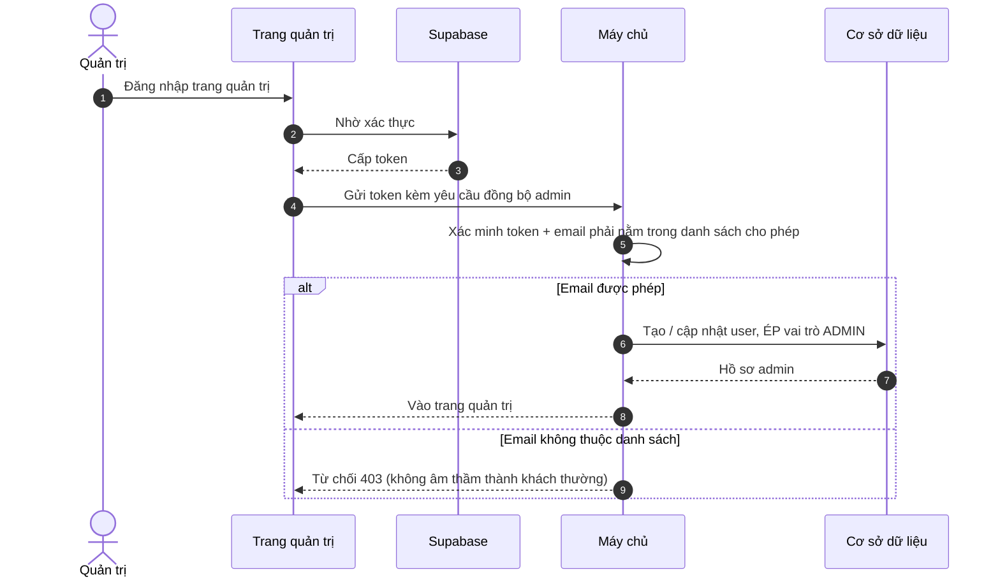

---

## `TourCategory`

### A-CAT-1 — List Categories (`GET /admin/tour-categories`)

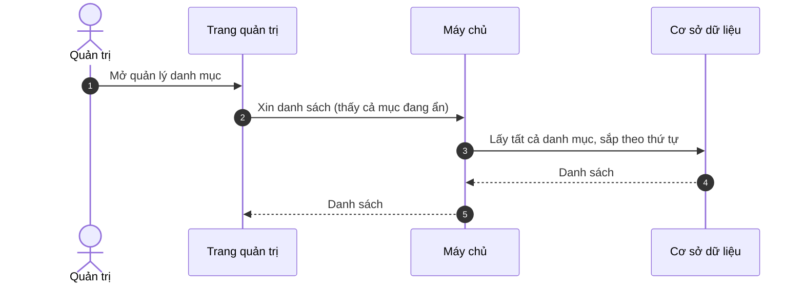

### A-CAT-2 — View Category (`GET /admin/tour-categories/{slug}`)

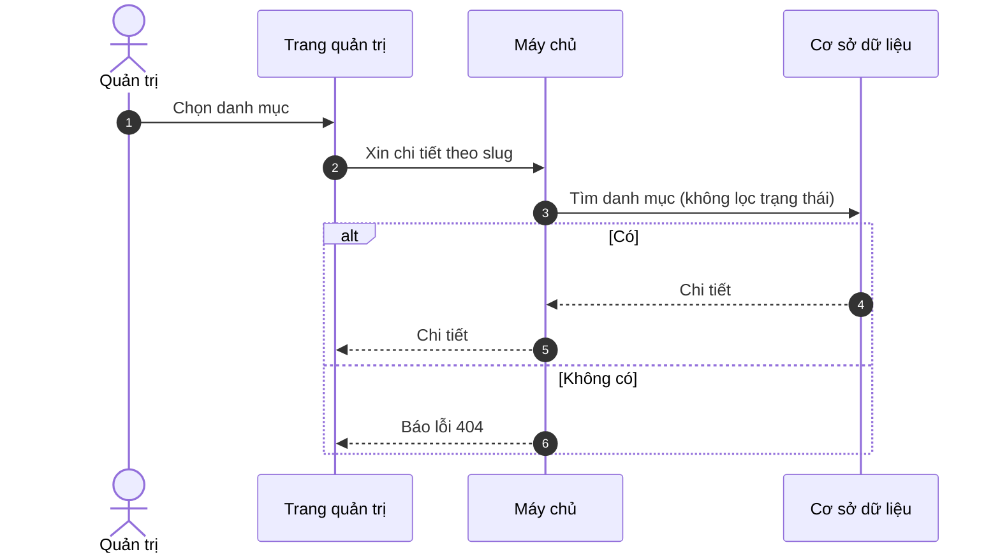

### A-CAT-3 — Create Category (`POST /admin/tour-categories`)

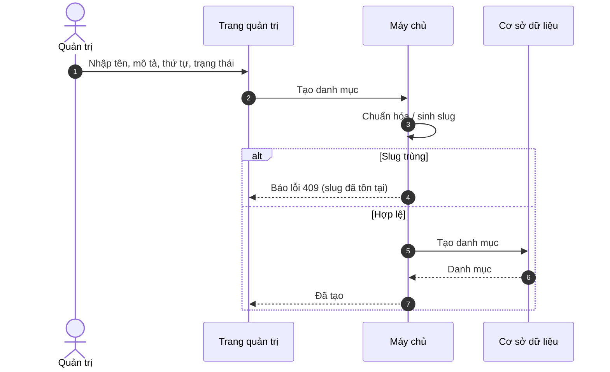

### A-CAT-4 — Update Category (`PATCH /admin/tour-categories/{slug}`)

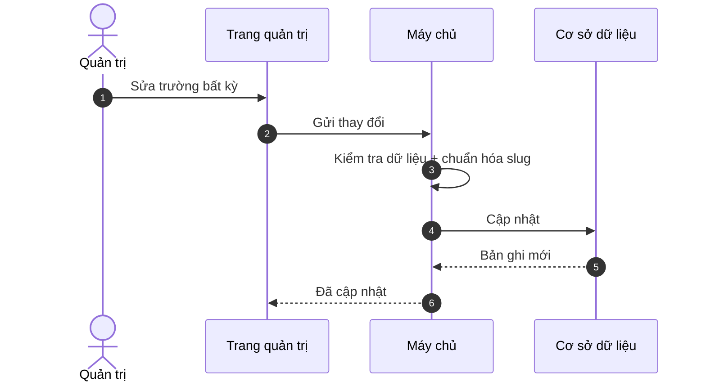

### A-CAT-5 — Delete Category (`DELETE /admin/tour-categories/{slug}`)

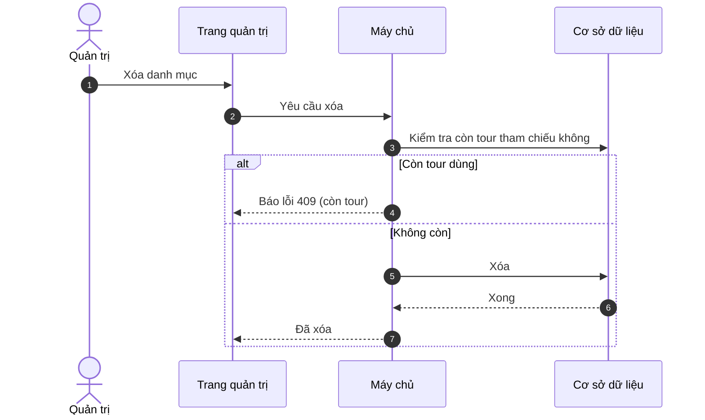

---

## `Destination`

### A-DST-1 — List Destinations (`GET /admin/destinations`)

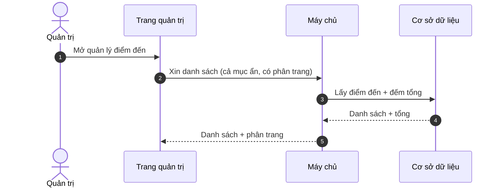

### A-DST-2 — View Destination (`GET /admin/destinations/{slug}`)

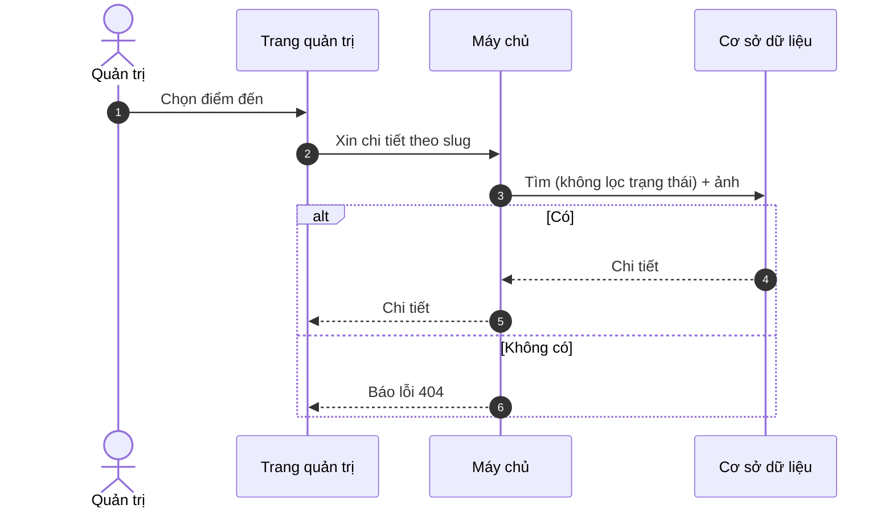

### A-DST-3 — Create Destination (`POST /admin/destinations`)

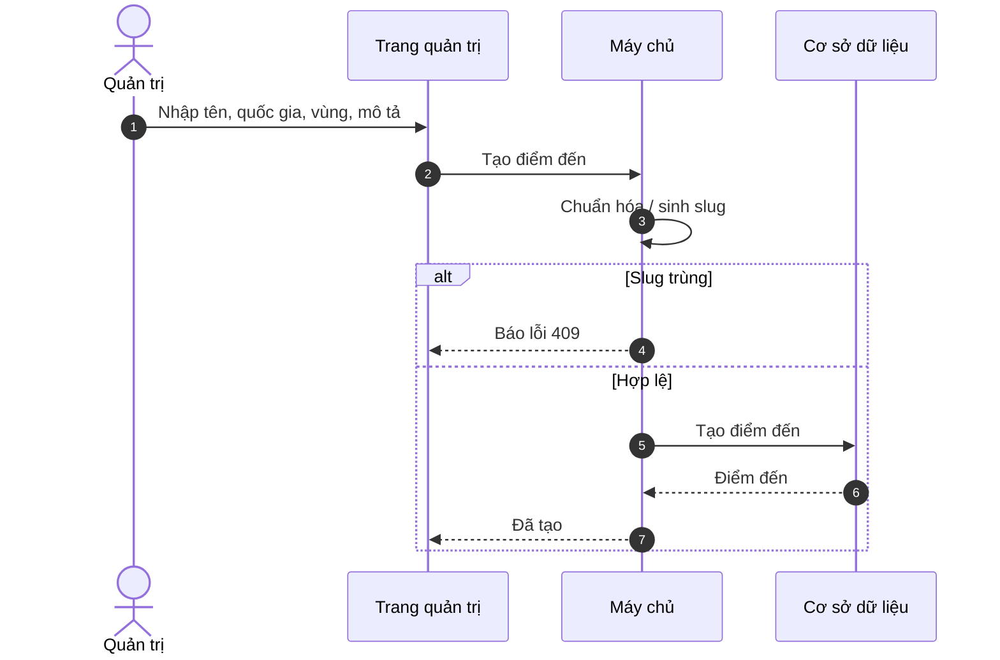

### A-DST-4 — Update Destination (`PATCH /admin/destinations/{slug}`)

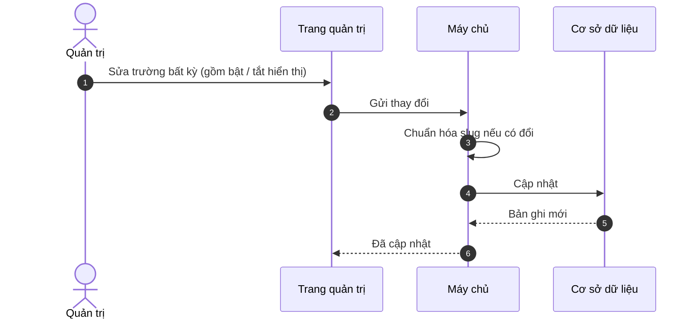

### A-DST-5 — Set Destination Media (`PUT /admin/destinations/{slug}/media`)

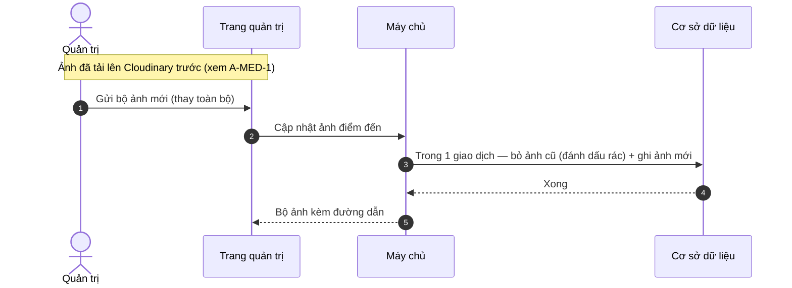

### A-DST-6 — Delete Destination (`DELETE /admin/destinations/{slug}`)

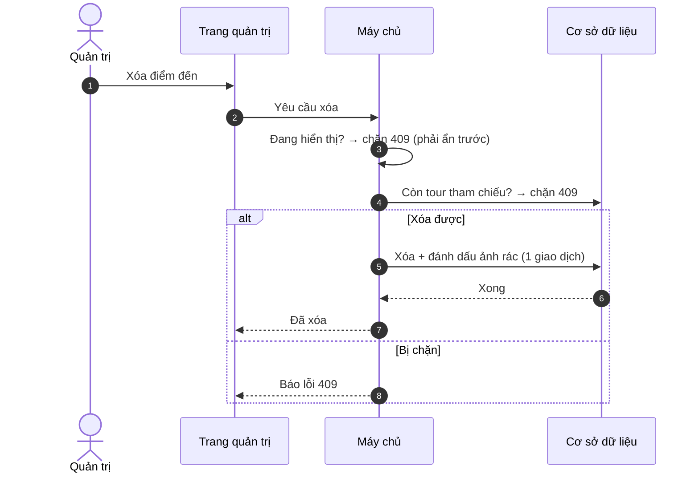

---

## `Tour`

### A-TUR-1 — List Tours (`GET /admin/tours`)

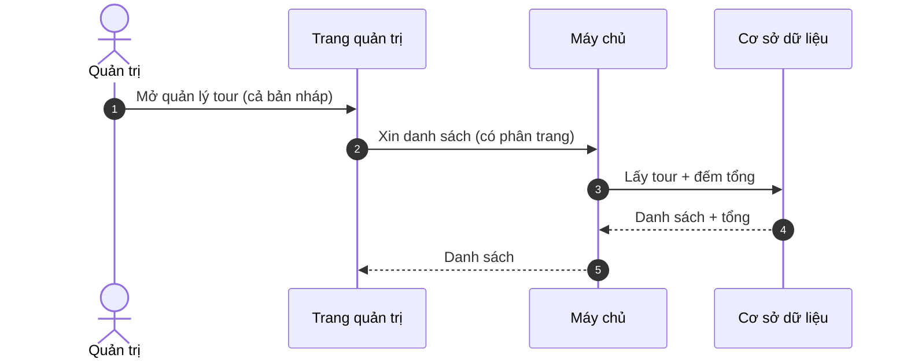

### A-TUR-2 — View Tour (`GET /admin/tours/{slug}`)

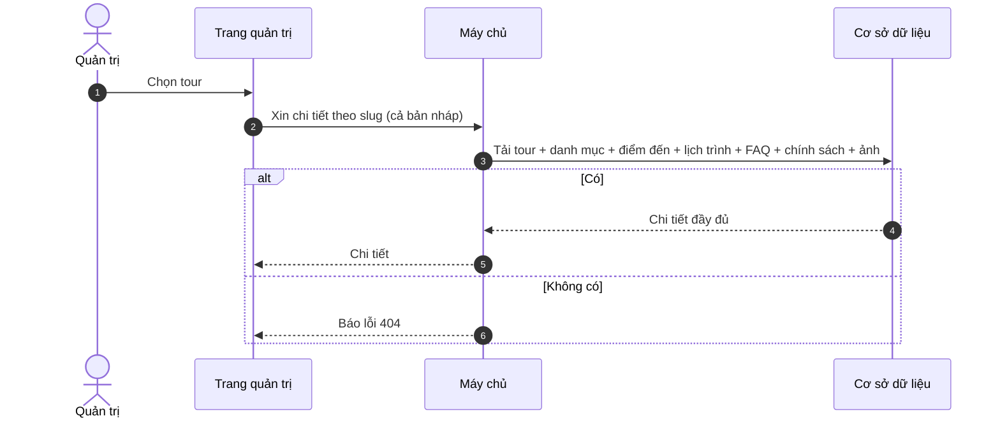

### A-TUR-3 — Create Tour (`POST /admin/tours`)

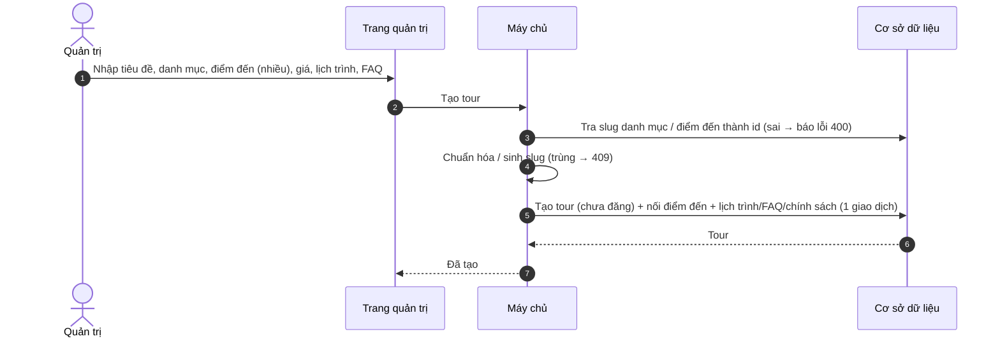

### A-TUR-4 — Update Tour (`PATCH /admin/tours/{slug}`)

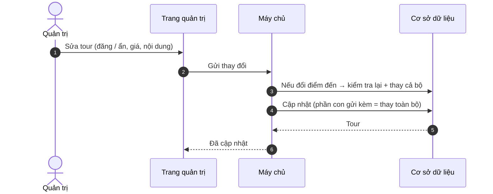

### A-TUR-5 — Set Tour Media (`PUT /admin/tours/{slug}/media`)


### A-TUR-6 — Delete Tour (`DELETE /admin/tours/{slug}`)

```mermaid
sequenceDiagram
    autonumber
    actor AD as Quản trị
    participant FE as Trang quản trị
    participant API as Máy chủ
    participant DB as Cơ sở dữ liệu
    AD->>FE: Xóa tour
    FE->>API: Yêu cầu xóa
    API->>API: Đang đăng? → chặn 409 (phải ẩn trước)
    API->>DB: Còn booking tham chiếu? → chặn 409
    alt Xóa được
        API->>DB: Xóa + ảnh rác; lịch trình/FAQ/chính sách/chuyến/đánh giá xóa theo (1 giao dịch)
        API-->>FE: Đã xóa
    else Bị chặn
        API-->>FE: Báo lỗi 409
    end
```

---

## `TourDeparture` (lịch khởi hành)

### A-DEP-1 — List Departures (`GET /admin/tours/{slug}/departures`)

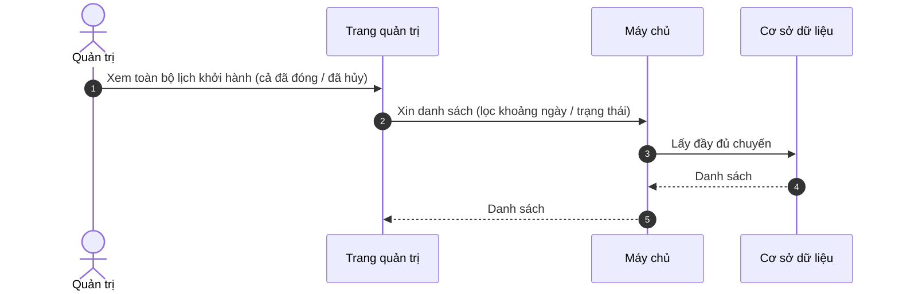

### A-DEP-2 — Create Departure (`POST /admin/tours/{slug}/departures`)

```mermaid
sequenceDiagram
    autonumber
    actor AD as Quản trị
    participant FE as Trang quản trị
    participant API as Máy chủ
    participant DB as Cơ sở dữ liệu
    AD->>FE: Nhập ngày đi / về, số ghế, giá, trạng thái
    FE->>API: Tạo chuyến
    API->>API: Ngày về sớm hơn ngày đi → 400; ngày đi đã qua → 400 (chống "chuyến ma")
    API->>DB: Tạo chuyến (ghế đã đặt = 0)
    DB-->>API: Chuyến
    API-->>FE: Đã tạo
```

### A-DEP-3 — Update Departure (`PATCH /admin/tours/{slug}/departures/{id}`)

```mermaid
sequenceDiagram
    autonumber
    actor AD as Quản trị
    participant FE as Trang quản trị
    participant API as Máy chủ
    participant DB as Cơ sở dữ liệu
    AD->>FE: Sửa chuyến (ghế, giá, trạng thái)
    FE->>API: Gửi thay đổi
    API->>API: Ghế tổng phải ≥ ghế đã đặt (else 400)
    API->>DB: Cập nhật
    DB-->>API: Chuyến
    API-->>FE: Đã cập nhật
```

### A-DEP-4 — Delete Departure (`DELETE /admin/tours/{slug}/departures/{id}`)

```mermaid
sequenceDiagram
    autonumber
    actor AD as Quản trị
    participant FE as Trang quản trị
    participant API as Máy chủ
    participant DB as Cơ sở dữ liệu
    AD->>FE: Xóa chuyến
    FE->>API: Yêu cầu xóa
    API->>DB: Đã bán ghế / còn booking? → kiểm tra
    alt Chưa từng có booking
        API->>DB: Xóa
        API-->>FE: Đã xóa
    else Có booking
        API-->>FE: Báo lỗi 409 (khuyến nghị đặt HỦY thay vì xóa)
    end
```

---

## `MediaAsset` / Uploads

### A-MED-1 — Sign Upload (`POST /admin/uploads/signed-url`)

Cấp "giấy phép" để file đi **thẳng** lên Cloudinary, không qua máy chủ.

```mermaid
sequenceDiagram
    autonumber
    actor AD as Quản trị
    participant FE as Trang quản trị
    participant API as Máy chủ
    participant CLD as Cloudinary
    AD->>FE: Chọn ảnh / video + mục đích dùng
    FE->>API: Xin giấy phép tải lên
    API->>API: Kiểm tra định dạng + ký giấy phép (server tự đặt nơi lưu)
    API-->>FE: Giấy phép (chữ ký, nơi lưu)
    FE->>CLD: Tải thẳng file lên Cloudinary
    CLD-->>FE: Tải lên xong
    Note over FE,API: Sau đó lưu địa chỉ ảnh qua A-DST-5 / A-TUR-5 / U-USR-4
```

---

## `Review`

### A-REV-1 — Moderation Queue (`GET /admin/reviews`)

```mermaid
sequenceDiagram
    autonumber
    actor AD as Quản trị
    participant FE as Trang quản trị
    participant API as Máy chủ
    participant DB as Cơ sở dữ liệu
    AD->>FE: Mở hàng chờ duyệt
    FE->>API: Xin danh sách (lọc đã duyệt / chưa duyệt)
    API->>DB: Lấy đánh giá + tên người viết + tour (admin xem được thông tin đầy đủ)
    DB-->>API: Danh sách
    API-->>FE: Danh sách
```

### A-REV-2 — Moderate Review (`PATCH /admin/reviews/{id}/moderation`)

```mermaid
sequenceDiagram
    autonumber
    actor AD as Quản trị
    participant FE as Trang quản trị
    participant API as Máy chủ
    participant DB as Cơ sở dữ liệu
    AD->>FE: Duyệt / từ chối đánh giá
    FE->>API: Gửi quyết định
    API->>DB: Cập nhật trạng thái; nếu chuyển sang ĐÃ DUYỆT → xếp email vào hàng đợi (1 giao dịch)
    DB-->>API: Đánh giá
    API-->>FE: Đã cập nhật
    Note over DB: Email "đã duyệt" gửi qua tác vụ nền (S-JOB-1)
```

---

## `Enquiry`

### A-ENQ-1 — CRM List (`GET /admin/enquiries`)

```mermaid
sequenceDiagram
    autonumber
    actor AD as Quản trị
    participant FE as Trang quản trị
    participant API as Máy chủ
    participant DB as Cơ sở dữ liệu
    AD->>FE: Mở CRM lead
    FE->>API: Xin danh sách (lọc trạng thái)
    API->>DB: Lấy lead + đếm (mới nhất trước)
    DB-->>API: Danh sách
    API-->>FE: Danh sách đầy đủ
```

### A-ENQ-2 — Update Enquiry Status (`PATCH /admin/enquiries/{id}/status`)

```mermaid
sequenceDiagram
    autonumber
    actor AD as Quản trị
    participant FE as Trang quản trị
    participant API as Máy chủ
    participant DB as Cơ sở dữ liệu
    AD->>FE: Chuyển trạng thái lead (MỚI → ĐÃ LIÊN HỆ → BÁO GIÁ → CHỐT / HỦY)
    FE->>API: Gửi trạng thái mới
    API->>DB: Cập nhật trạng thái
    DB-->>API: Lead
    API-->>FE: Đã cập nhật
```

---

## `Booking`

### A-BKG-1 — List Bookings (`GET /admin/bookings`)

```mermaid
sequenceDiagram
    autonumber
    actor AD as Quản trị
    participant FE as Trang quản trị
    participant API as Máy chủ
    participant DB as Cơ sở dữ liệu
    AD->>FE: Mở quản lý đơn hàng
    FE->>API: Xin danh sách (lọc trạng thái, tìm theo mã / email / tên)
    API->>DB: Lấy đơn (kèm tour + chuyến) + đếm (mới nhất trước)
    DB-->>API: Danh sách + tổng
    API-->>FE: Danh sách + phân trang
```

### A-BKG-2 — Booking Detail (`GET /admin/bookings/{ma}`)

```mermaid
sequenceDiagram
    autonumber
    actor AD as Quản trị
    participant FE as Trang quản trị
    participant API as Máy chủ
    participant DB as Cơ sở dữ liệu
    AD->>FE: Chọn đơn theo mã
    FE->>API: Xin chi tiết đơn
    API->>DB: Tìm đơn (admin xem MỌI đơn, không cần là chủ)
    alt Có
        DB-->>API: Chi tiết
        API-->>FE: Chi tiết + tour + chuyến
    else Không có
        API-->>FE: Báo lỗi 404
    end
```

### A-BKG-3 — Refund Booking (`POST /admin/bookings/{ma}/refund`)

```mermaid
sequenceDiagram
    autonumber
    actor AD as Quản trị
    participant FE as Trang quản trị
    participant API as Máy chủ
    participant PAY as Cổng thanh toán
    participant DB as Cơ sở dữ liệu
    AD->>FE: Chọn đơn đã trả tiền, nhập lý do, bấm Hoàn tiền
    FE->>API: Yêu cầu hoàn tiền
    API->>API: Phải đã thanh toán + có mã giao dịch (else 400)
    API->>PAY: Gọi hoàn tiền (cổng TRƯỚC)
    alt Cổng hoàn tiền OK
        PAY-->>API: Đã hoàn
        API->>DB: Trả ghế + ĐÃ HOÀN TIỀN + lưu lý do / người duyệt + xếp email (1 giao dịch)
        API-->>FE: Đơn đã hoàn
    else Cổng lỗi
        API-->>FE: Báo lỗi (đơn vẫn ĐÃ THANH TOÁN, thử lại được)
    end
```

---

## Stats

### A-STA-1 — Dashboard Stats (`GET /admin/stats/dashboard`)

```mermaid
sequenceDiagram
    autonumber
    actor AD as Quản trị
    participant FE as Trang quản trị
    participant API as Máy chủ
    participant DB as Cơ sở dữ liệu
    AD->>FE: Mở dashboard
    FE->>API: Xin số liệu tổng hợp
    API->>DB: Chạy song song — doanh thu, đơn theo trạng thái, top tour, xu hướng 6 tháng
    DB-->>API: Các con số
    API-->>FE: Bảng thống kê
```

---

## `Post` (blog biên tập)

### A-PST-1 — List Posts (`GET /admin/posts`)

```mermaid
sequenceDiagram
    autonumber
    actor AD as Quản trị
    participant FE as Trang quản trị
    participant API as Máy chủ
    participant DB as Cơ sở dữ liệu
    AD->>FE: Mở quản lý blog
    FE->>API: Xin danh sách (cả bản nháp, lọc trạng thái / từ khóa)
    API->>DB: Lấy bài + đếm (mới nhất trước)
    DB-->>API: Danh sách
    API-->>FE: Danh sách
```

### A-PST-2 — View Post (`GET /admin/posts/{slug}`)

```mermaid
sequenceDiagram
    autonumber
    actor AD as Quản trị
    participant FE as Trang quản trị
    participant API as Máy chủ
    participant DB as Cơ sở dữ liệu
    AD->>FE: Chọn bài viết
    FE->>API: Xin chi tiết theo slug (không lọc trạng thái)
    API->>DB: Tìm bài
    alt Có
        DB-->>API: Chi tiết
        API-->>FE: Chi tiết
    else Không có
        API-->>FE: Báo lỗi 404
    end
```

### A-PST-3 — Create Post (`POST /admin/posts`)

```mermaid
sequenceDiagram
    autonumber
    actor AD as Quản trị
    participant FE as Trang quản trị
    participant API as Máy chủ
    participant DB as Cơ sở dữ liệu
    AD->>FE: Nhập tiêu đề, tóm tắt, nội dung, trạng thái
    FE->>API: Tạo bài
    API->>API: Tác giả lấy từ token; chuẩn hóa / sinh slug (trùng → 409)
    API->>DB: Tạo bài; nếu ĐÃ ĐĂNG → ghi mốc thời gian đăng
    DB-->>API: Bài
    API-->>FE: Đã tạo
```

### A-PST-4 — Update Post (`PATCH /admin/posts/{slug}`)

```mermaid
sequenceDiagram
    autonumber
    actor AD as Quản trị
    participant FE as Trang quản trị
    participant API as Máy chủ
    participant DB as Cơ sở dữ liệu
    AD->>FE: Sửa bài (đăng / ẩn, nội dung)
    FE->>API: Gửi thay đổi
    API->>API: Chuẩn hóa slug; LẦN ĐẦU chuyển ĐÃ ĐĂNG → ghi mốc thời gian
    API->>DB: Cập nhật
    DB-->>API: Bài
    API-->>FE: Đã cập nhật
```

### A-PST-5 — Delete Post (`DELETE /admin/posts/{slug}`)

```mermaid
sequenceDiagram
    autonumber
    actor AD as Quản trị
    participant FE as Trang quản trị
    participant API as Máy chủ
    participant DB as Cơ sở dữ liệu
    AD->>FE: Xóa bài
    FE->>API: Yêu cầu xóa
    API->>DB: Tìm bài (không có → 404); xóa cứng
    DB-->>API: Xong
    API-->>FE: Đã xóa
```

---

## Lịch sử

- **2026-06-24** — Khởi tạo bộ sequence diagram **mỗi function một sơ đồ** cho phía
  admin (A-USR…A-PST, gồm A-BKG-1/2 mới), nhãn tiếng Việt, gọn khổ A4. Đối chiếu
  [functions-admin.md](functions-admin.md); sơ đồ tổng quan ở
  [sequence-diagrams.md](sequence-diagrams.md).
