# Sequence Diagrams — Customer (mỗi function một sơ đồ)

Sơ đồ tuần tự **riêng cho từng function khách hàng** trong
[functions-customer.md](functions-customer.md). Mỗi mục = 1 function, gọn trong
một khổ A4. Sơ đồ kể chuyện end-to-end nhiều bước xem ở
[sequence-diagrams.md](sequence-diagrams.md).

> **Cách đọc nhanh:** 👤 = con người · hộp = hệ thống · mũi tên liền = yêu cầu ·
> mũi tên đứt = phản hồi · `alt/else` = các tình huống · ô ghi chú = giải thích
> "vì sao". Nhân vật: **Khách** · **Giao diện** (web/app) · **Máy chủ** (`@tourism/api`)
> · **Cơ sở dữ liệu** · **Supabase** (đăng nhập) · **Cổng thanh toán** ·
> **Tác vụ nền** (job theo lịch).

---

## Account · `User`

### U-USR-1 — Sync Account (`POST /auth/sync`)

Đăng nhập qua Supabase rồi "ghi nhận" tài khoản vào hệ thống nội bộ.

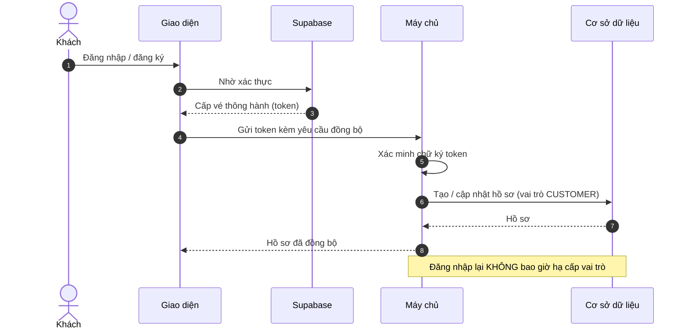

### U-USR-2 — View Profile (`GET /users/me`)

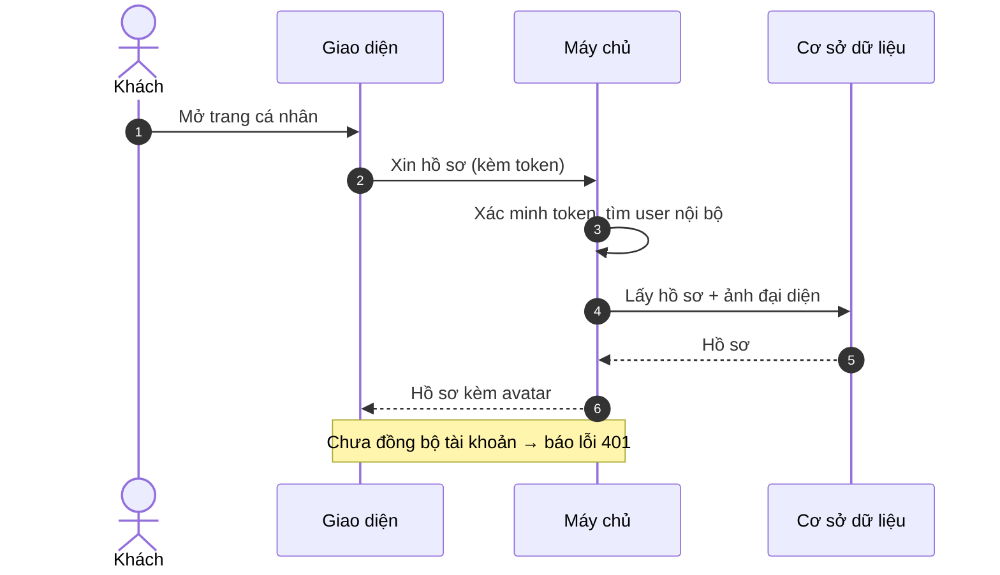

### U-USR-3 — Update Profile (`PATCH /users/me`)

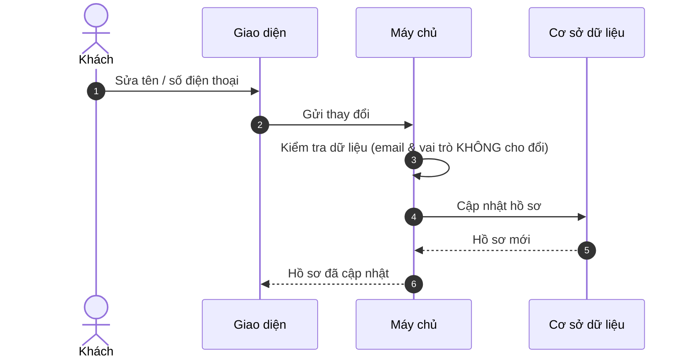

### U-USR-4 — Set Avatar (`PUT /users/me/avatar`)

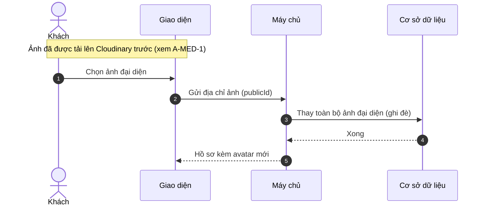

### U-USR-5 — Clear Avatar (`DELETE /users/me/avatar`)

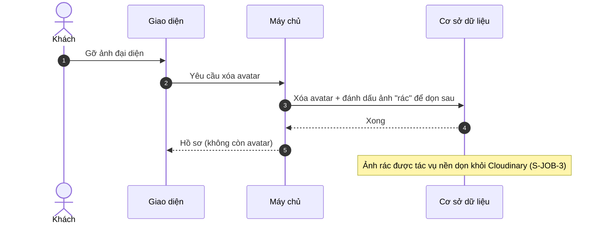

---

## `Destination` (công khai)

### U-DST-1 — Browse Destinations (`GET /destinations`)

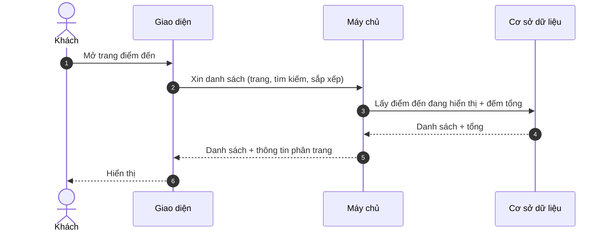

### U-DST-2 — Destination Detail (`GET /destinations/{slug}`)

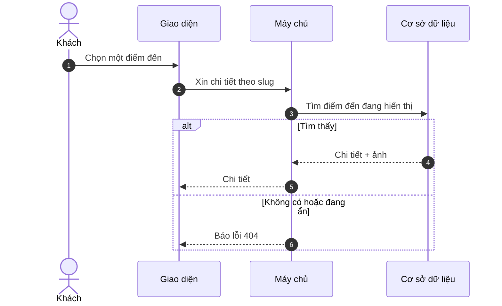

---

## `TourCategory` (công khai)

### U-CAT-1 — List Categories (`GET /tour-categories`)

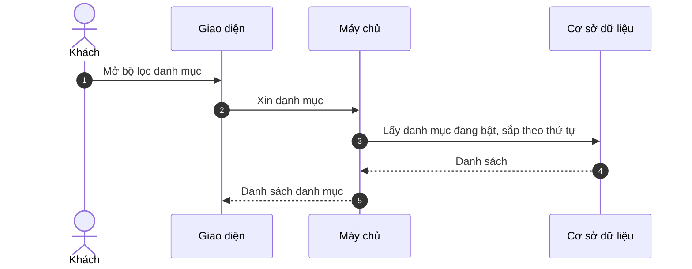

### U-CAT-2 — Category Detail (`GET /tour-categories/{slug}`)

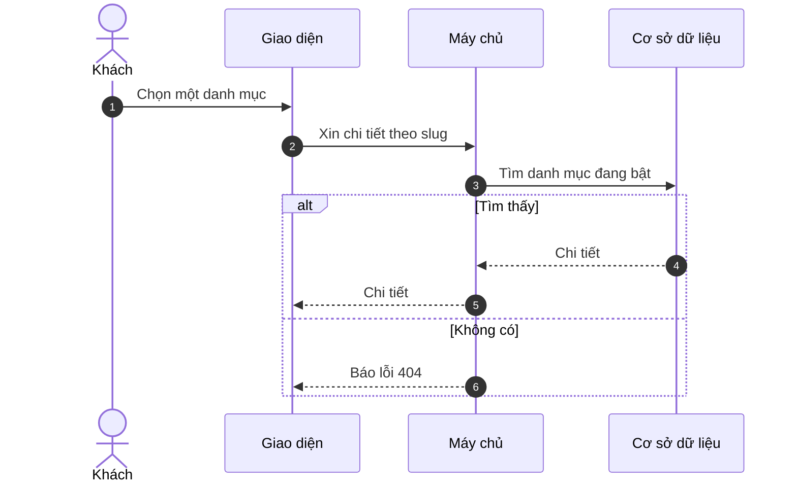

---

## `Tour` (công khai)

### U-TUR-1 — Browse / Search Tours (`GET /tours`)

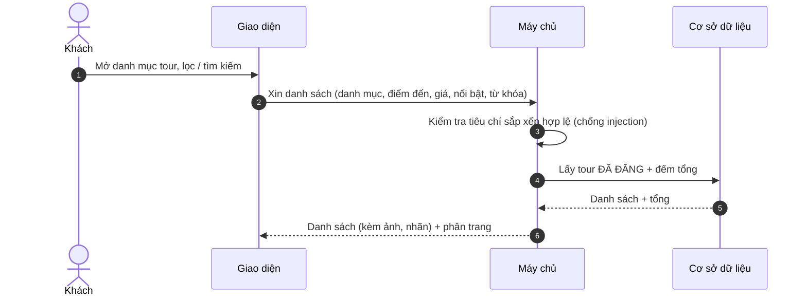

### U-TUR-2 — Tour Detail (`GET /tours/{slug}`)

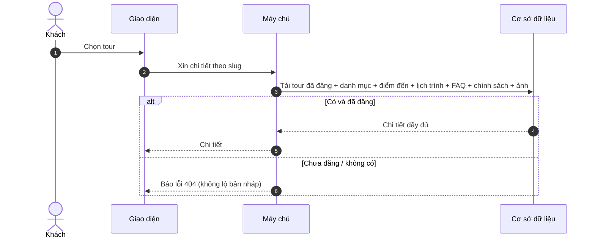

---

## `TourDeparture` (công khai)

### U-DEP-1 — View Departures (`GET /tours/{slug}/departures`)

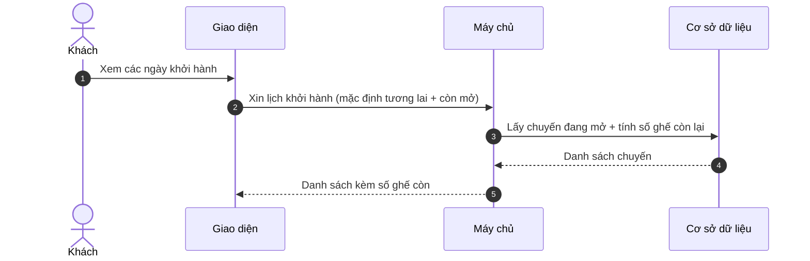

---

## `Review`

### U-REV-1 — View Tour Reviews (`GET /tours/{slug}/reviews`)

```mermaid
sequenceDiagram
    autonumber
    actor KH as Khách
    participant FE as Giao diện
    participant API as Máy chủ
    participant DB as Cơ sở dữ liệu
    KH->>FE: Xem đánh giá của tour
    FE->>API: Xin danh sách đánh giá
    API->>DB: Kiểm tra tour đã đăng; lấy đánh giá ĐÃ DUYỆT
    DB-->>API: Danh sách + điểm trung bình
    API-->>FE: Danh sách (chỉ lộ tên người viết)
    Note over API,FE: Ẩn thông tin cá nhân khác
```

### U-REV-2 — Write Review (`POST /reviews`)

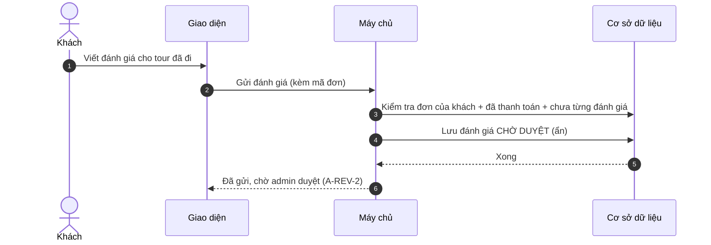

---

## `Booking`

### U-BKG-1 — Create Booking (`POST /bookings`)

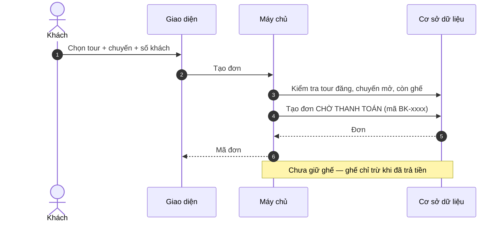

### U-BKG-2 — My Bookings (`GET /bookings/me`)

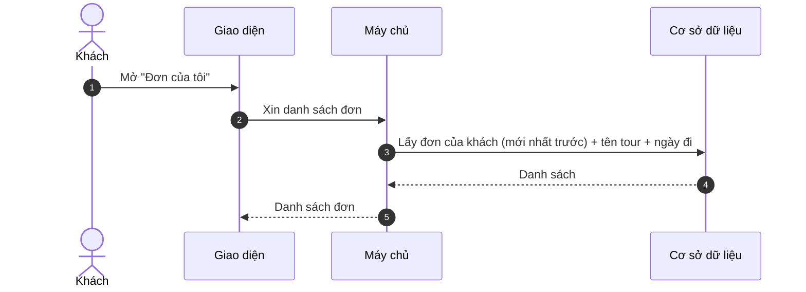

### U-BKG-3 — Booking Detail (`GET /bookings/{ma}`)

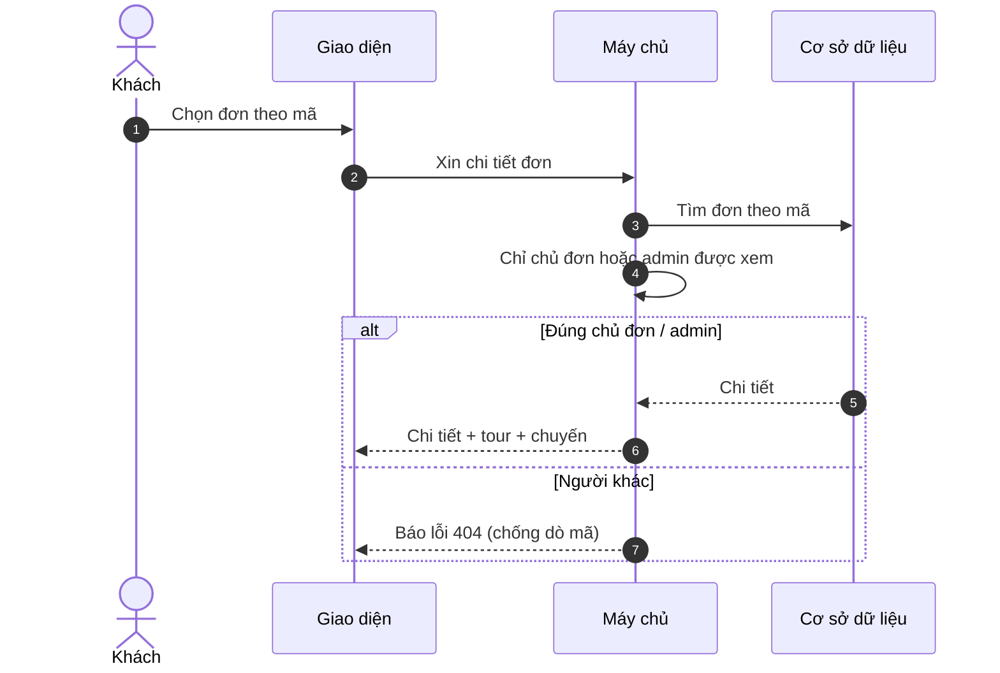

### U-BKG-4 — Start Checkout (`POST /bookings/{ma}/checkout`)

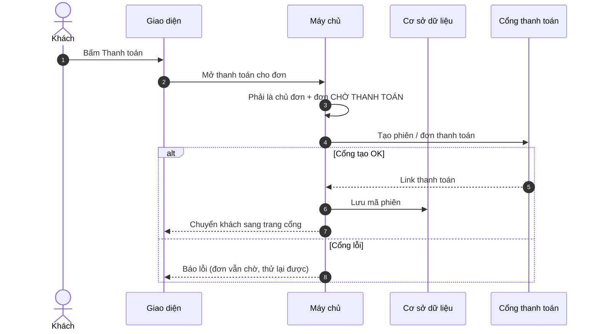

### U-BKG-5 — Capture PayPal (`POST /bookings/{ma}/capture`)

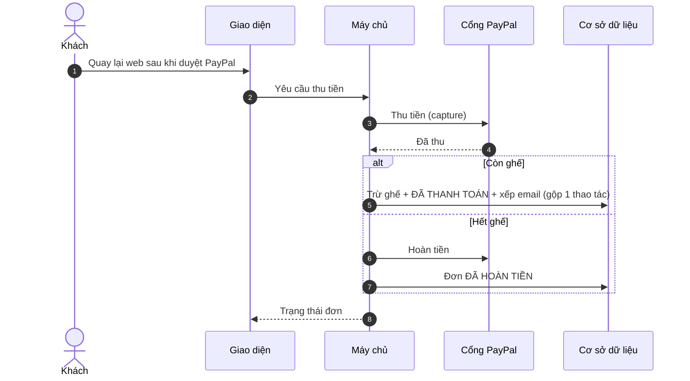

### U-BKG-6 — Cancel Booking (`POST /bookings/{ma}/cancel`)

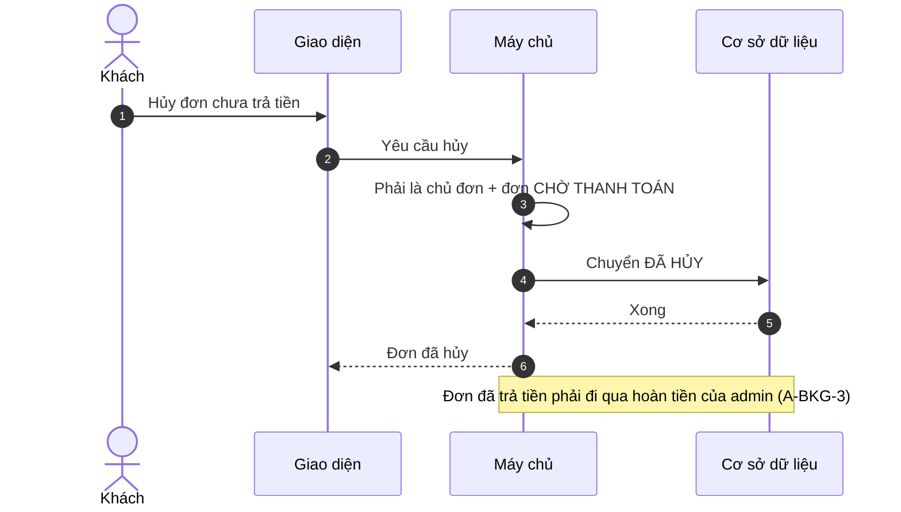

---

## `Wishlist`

### U-WSH-1 — Add to Wishlist (`POST /wishlist/{tourId}`)

```mermaid
sequenceDiagram
    autonumber
    actor KH as Khách
    participant FE as Giao diện
    participant API as Máy chủ
    participant DB as Cơ sở dữ liệu
    KH->>FE: Bấm thích một tour
    FE->>API: Thêm vào yêu thích
    API->>DB: Kiểm tra tour tồn tại + đã đăng
    API->>DB: Thêm vào yêu thích (thích lại cũng không lỗi)
    DB-->>API: Xong
    API-->>FE: Đã thêm
```

### U-WSH-2 — Remove from Wishlist (`DELETE /wishlist/{tourId}`)

```mermaid
sequenceDiagram
    autonumber
    actor KH as Khách
    participant FE as Giao diện
    participant API as Máy chủ
    participant DB as Cơ sở dữ liệu
    KH->>FE: Bỏ thích
    FE->>API: Xóa khỏi yêu thích
    API->>DB: Xóa (không có cũng không lỗi)
    DB-->>API: Xong
    API-->>FE: Đã bỏ
```

### U-WSH-3 — View Wishlist (`GET /wishlist/me`)

```mermaid
sequenceDiagram
    autonumber
    actor KH as Khách
    participant FE as Giao diện
    participant API as Máy chủ
    participant DB as Cơ sở dữ liệu
    KH->>FE: Mở danh sách yêu thích
    FE->>API: Xin danh sách
    API->>DB: Lấy danh sách + preview tour (mới nhất trước)
    DB-->>API: Danh sách
    API-->>FE: Danh sách (kèm cờ tour còn đăng hay không)
```

---

## `Enquiry` (công khai)

### U-ENQ-1 — Submit Enquiry (`POST /enquiries`)

```mermaid
sequenceDiagram
    autonumber
    actor KH as Khách
    participant FE as Giao diện
    participant API as Máy chủ
    participant DB as Cơ sở dữ liệu
    KH->>FE: Điền form tư vấn
    FE->>API: Gửi yêu cầu (công khai)
    API->>API: Chặn spam — 5 lần/phút + bẫy ô ẩn
    alt Phát hiện là bot
        API-->>FE: Phản hồi giả "đã nhận" (KHÔNG lưu)
    else Khách thật
        API->>DB: Lưu yêu cầu MỚI + xếp email xác nhận
        API-->>KH: Đã nhận yêu cầu
    end
    Note over DB: Email xác nhận gửi qua tác vụ nền (S-JOB-1)
```

---

## `Post` (blog công khai)

### U-PST-1 — List Posts (`GET /posts`)

```mermaid
sequenceDiagram
    autonumber
    actor KH as Khách
    participant FE as Giao diện
    participant API as Máy chủ
    participant DB as Cơ sở dữ liệu
    KH->>FE: Mở trang blog
    FE->>API: Xin danh sách bài (trang, tìm kiếm)
    API->>DB: Lấy bài ĐÃ ĐĂNG và tới giờ hiển thị
    DB-->>API: Danh sách
    API-->>FE: Danh sách bài
```

### U-PST-2 — Post Detail (`GET /posts/{slug}`)

```mermaid
sequenceDiagram
    autonumber
    actor KH as Khách
    participant FE as Giao diện
    participant API as Máy chủ
    participant DB as Cơ sở dữ liệu
    KH->>FE: Chọn bài viết
    FE->>API: Xin chi tiết theo slug
    API->>DB: Tìm bài đã đăng + tới giờ hiển thị
    alt Có
        DB-->>API: Nội dung
        API-->>FE: Chi tiết bài
    else Nháp / hẹn giờ / không có
        API-->>FE: Báo lỗi 404
    end
```

---

## Lịch sử

- **2026-06-24** — Khởi tạo bộ sequence diagram **mỗi function một sơ đồ** cho phía
  customer (U-USR…U-PST), nhãn tiếng Việt, gọn khổ A4. Đối chiếu
  [functions-customer.md](functions-customer.md); sơ đồ tổng quan ở
  [sequence-diagrams.md](sequence-diagrams.md).
