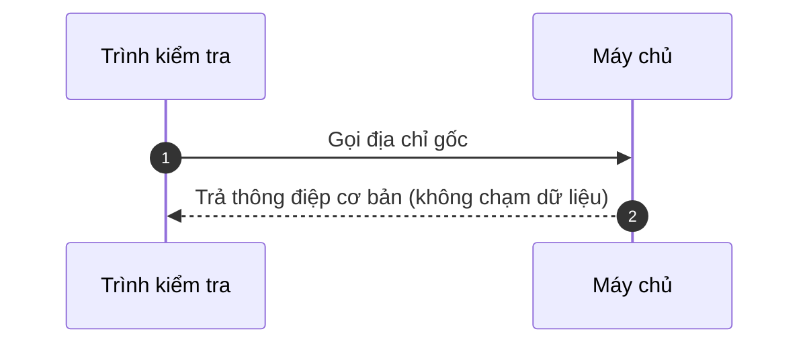
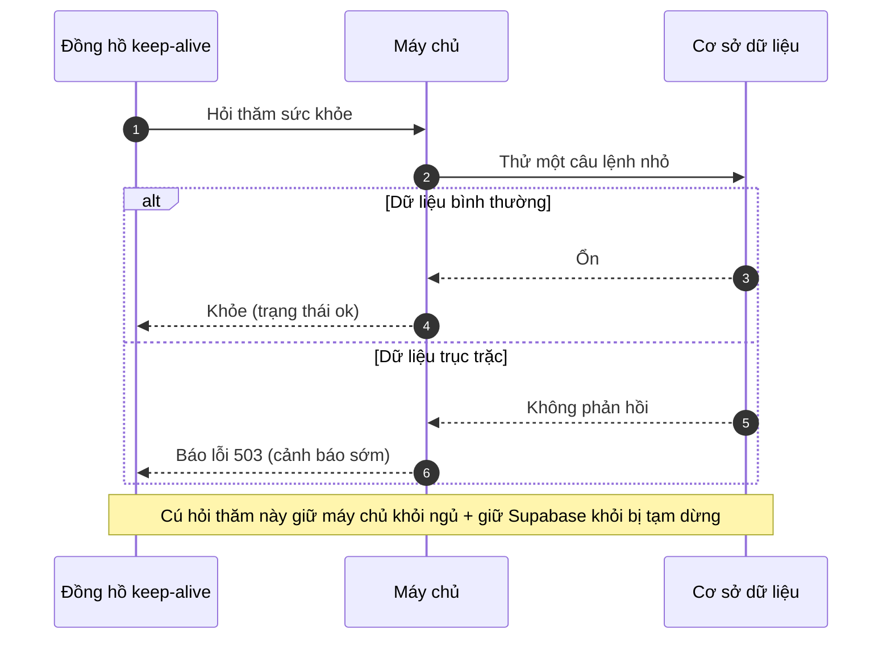
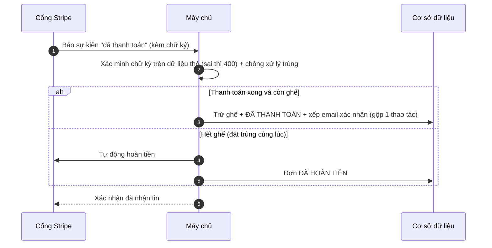
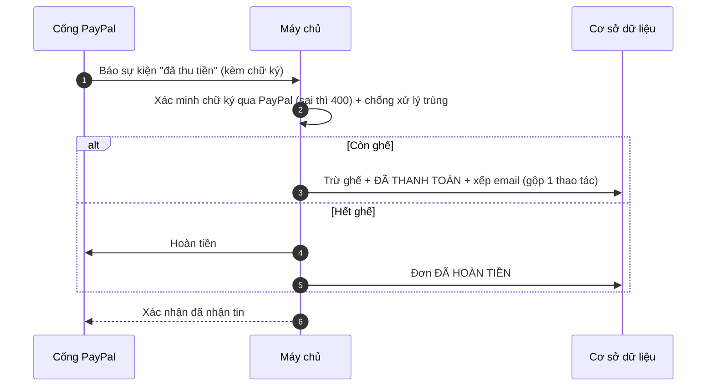
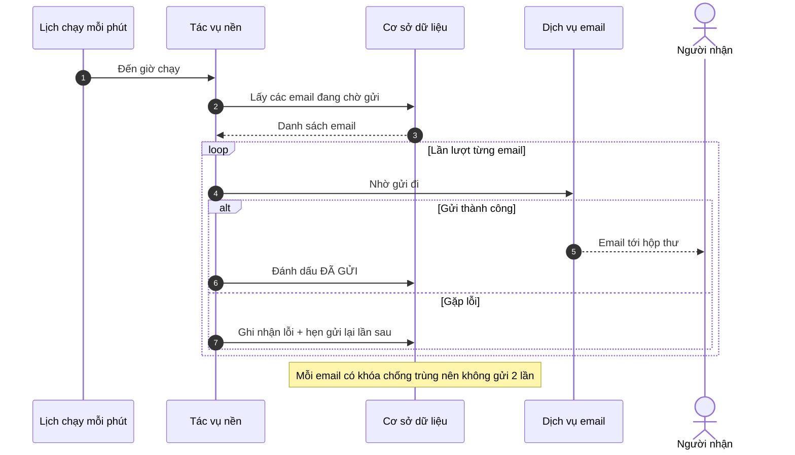
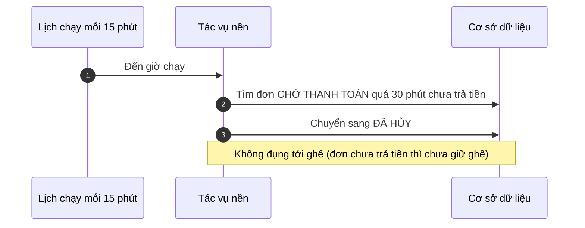
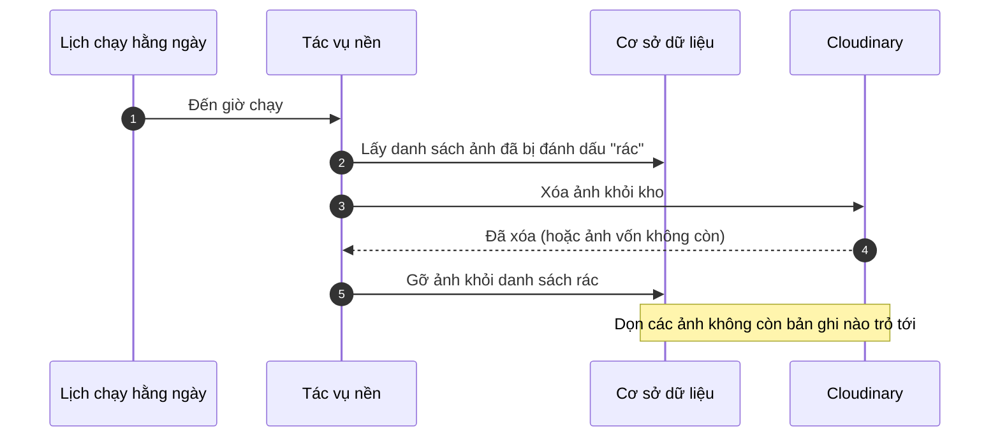

# Sequence Diagrams — System (mỗi function một sơ đồ)

Sơ đồ tuần tự **riêng cho từng function hệ thống** trong
[functions-system.md](functions-system.md): kiểm tra sức khỏe, webhook thanh toán,
và job nền theo lịch. Mỗi mục = 1 function, gọn trong một khổ A4.

> **Cách đọc nhanh:** hộp = hệ thống / dịch vụ · mũi tên liền = yêu cầu · mũi tên
> đứt = phản hồi · `alt/else` = các tình huống · `loop` = lặp lại · ô ghi chú =
> giải thích "vì sao". Các function này **không do người dùng bấm** — chúng do máy
> tự gọi (probe, cổng thanh toán, hoặc đồng hồ hẹn giờ). Nhân vật: **Trình kiểm
> tra/Đồng hồ** · **Máy chủ** (`@tourism/api`) · **Cơ sở dữ liệu** · **Cổng thanh
> toán** · **Tác vụ nền** (pg-boss) · **Dịch vụ email** · **Cloudinary**.

---

## Liveness / Readiness

### S-SYS-1 — Root / Liveness (`GET /`)

Kiểm tra máy chủ "có sống không" — không đụng cơ sở dữ liệu.

### S-SYS-2 — Readiness / Health (`GET /health`)

Kiểm tra máy chủ "có sẵn sàng phục vụ không" — có thử chạm cơ sở dữ liệu. Đồng hồ
keep-alive gọi mỗi phút để giữ hệ thống luôn thức.

---

## `PaymentEvent` — Webhooks (cổng thanh toán tự gọi)

### S-PAY-1 — Stripe Webhook (`POST /payments/stripe/webhook`)

Stripe chủ động báo về khi khách trả tiền xong. Đây là nơi đơn được chốt PAID.

### S-PAY-2 — PayPal Webhook (`POST /payments/paypal/webhook`)

Lưới an toàn cho trường hợp khách lỡ đóng trình duyệt sau khi PayPal duyệt tiền
(thường đơn đã được chốt ở bước thu tiền U-BKG-5).

---

## Background jobs (pg-boss, chạy theo lịch)

### S-JOB-1 — Outbox Drain (gửi email, cron mỗi phút)

### S-JOB-2 — Abandoned-booking Cleanup (hủy đơn bỏ dở, cron mỗi 15 phút)

### S-JOB-3 — Media Reconcile (dọn ảnh mồ côi, cron mỗi ngày 3h sáng)

---

## Lịch sử

- **2026-06-24** — Khởi tạo bộ sequence diagram **mỗi function một sơ đồ** cho phía
  system (S-SYS / S-PAY / S-JOB, gồm S-SYS-2 health mới), nhãn tiếng Việt, gọn khổ
  A4. Đối chiếu [functions-system.md](functions-system.md); sơ đồ tổng quan ở
  [sequence-diagrams.md](sequence-diagrams.md).
