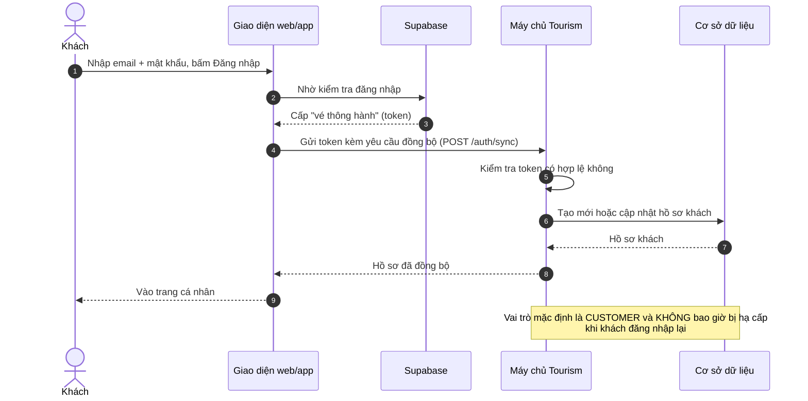
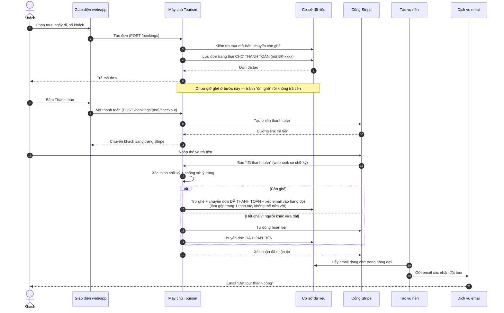
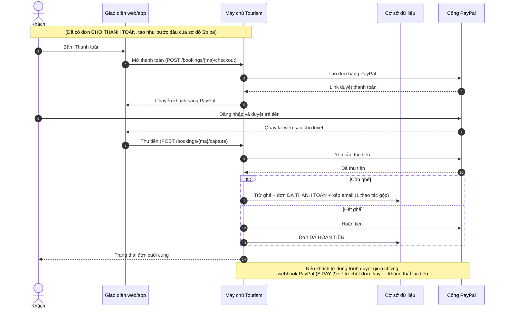
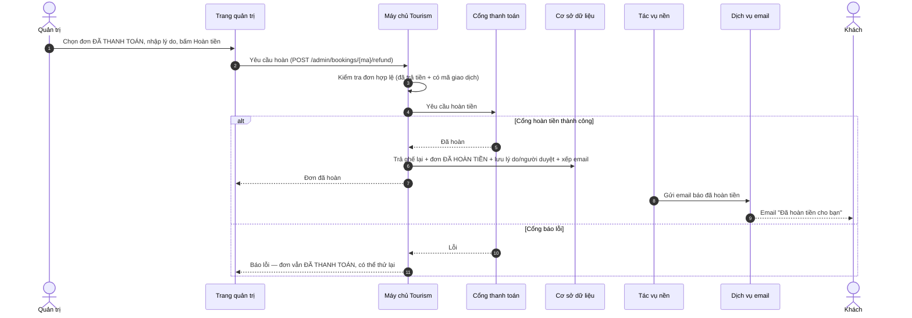
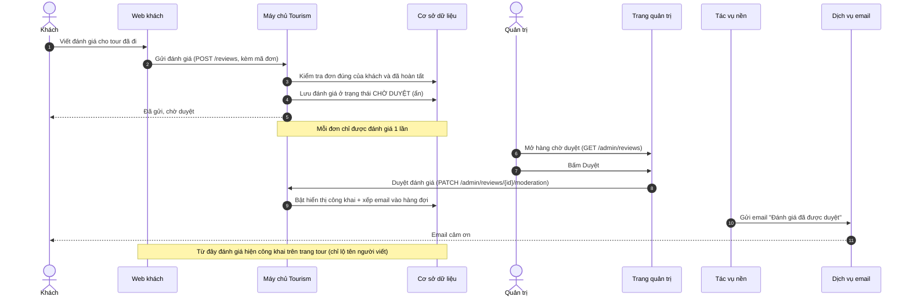
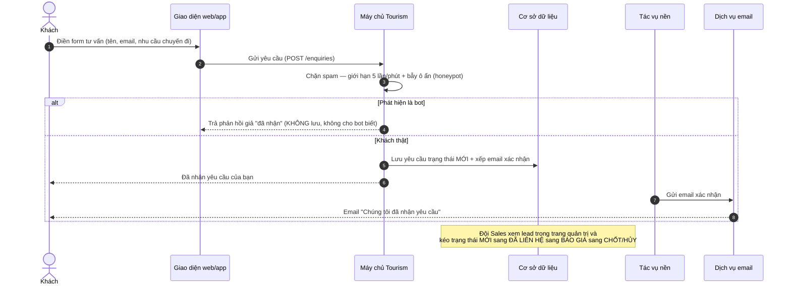
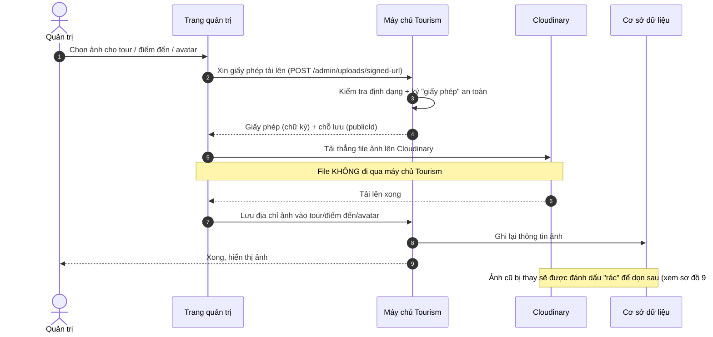
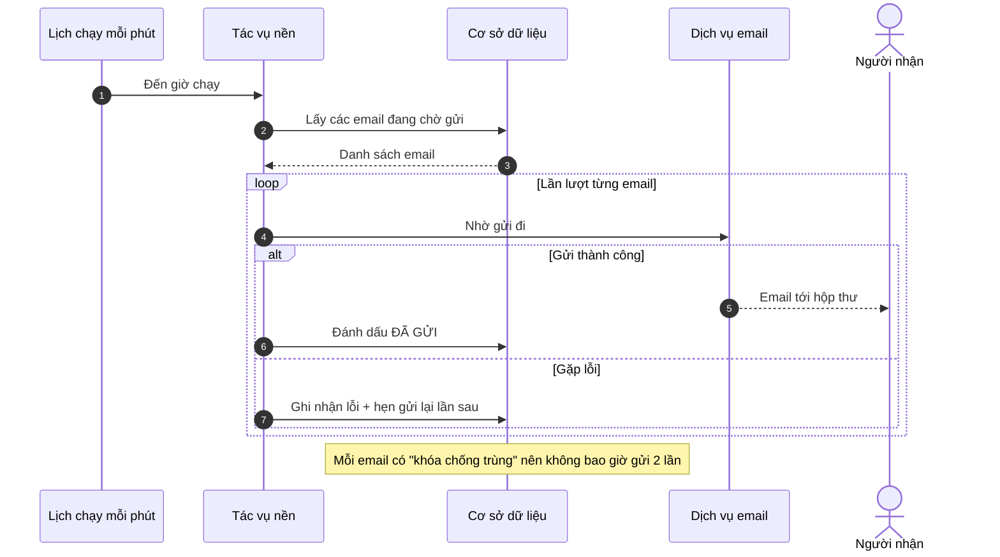
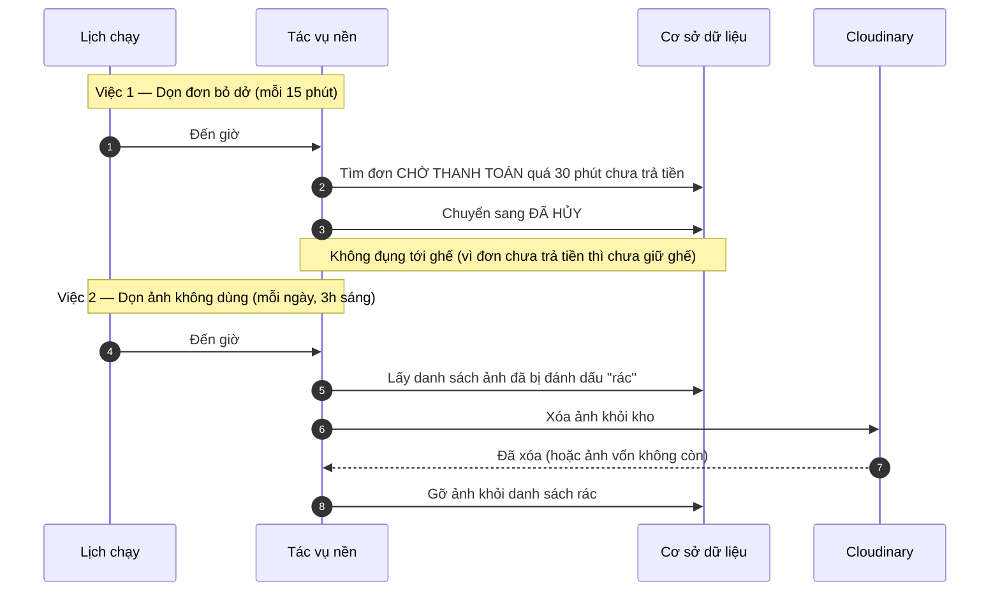
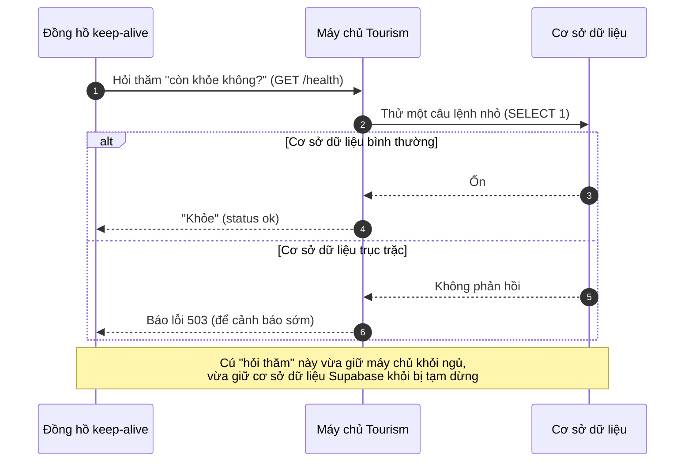

# Sequence Diagrams — Các hành trình chính

Sơ đồ tuần tự (Mermaid) cho **những luồng nghiệp vụ quan trọng** của
`@tourism/api`, dựng từ 3 catalog function:
[functions-customer.md](functions-customer.md) ·
[functions-admin.md](functions-admin.md) ·
[functions-system.md](functions-system.md).

Mỗi sơ đồ kể **một câu chuyện**, viết nhãn tiếng Việt đời thường để người
không rành kỹ thuật vẫn hiểu đang xảy ra điều gì; mã function (vd `U-BKG-1`) ghi
ở cuối mỗi mục để tra ngược về catalog.

> Các sơ đồ này render trực tiếp trên GitHub/VS Code (có hỗ trợ Mermaid). Trong
> VS Code, mở Preview (`Ctrl+Shift+V`) để xem hình.

---

## Cách đọc một sơ đồ tuần tự (cho người mới)

- **Cột dọc** = một "người" hoặc một "hệ thống" tham gia. Hình 👤 (que) là **con
  người**; hình hộp là **hệ thống/dịch vụ**.
- **Thời gian chạy từ trên xuống dưới.** Số thứ tự ở đầu mỗi dòng = bước 1, 2, 3…
- **Mũi tên liền `───▶`** = ai đó **gửi yêu cầu / ra lệnh** cho bên kia.
- **Mũi tên đứt `┄┄▶`** = **kết quả trả về**.
- **Ô ghi chú (màu vàng)** = giải thích **"vì sao"** bước đó tồn tại.
- **Khối `alt / else`** = các **tình huống có thể xảy ra** (vd: còn ghế / hết ghế).
- **Khối `loop`** = việc **lặp lại** (vd: gửi từng email một).

### Các "nhân vật" xuất hiện xuyên suốt

| Nhân vật | Là gì |
| --- | --- |
| **Khách** / **Quản trị** | Người dùng cuối (con người) |
| **Giao diện web/app** | Trang web hoặc app khách đang bấm (frontend) |
| **Máy chủ Tourism** | Backend `@tourism/api` — bộ não xử lý nghiệp vụ |
| **Cơ sở dữ liệu** | Nơi lưu đơn hàng, tour, đánh giá… (Postgres) |
| **Cổng Stripe / PayPal** | Dịch vụ thu tiền bên ngoài |
| **Cloudinary** | Kho lưu ảnh/video bên ngoài |
| **Tác vụ nền** | "Người làm thầm lặng" chạy theo lịch (pg-boss) |
| **Dịch vụ email (Resend)** | Bên thực sự gửi email đi |
| **Supabase** | Dịch vụ lo việc đăng nhập/mật khẩu |

---

## 1. Đăng nhập & đồng bộ tài khoản

Khách đăng nhập qua Supabase, sau đó máy chủ "ghi nhận" tài khoản vào hệ thống
nội bộ để biết ai đang thao tác.

> **Quản trị viên** đi đường riêng (`POST /auth/admin/sync`): email bắt buộc nằm
> trong danh sách cho phép `ADMIN_EMAILS`, nếu không sẽ bị từ chối (403).
>
> _Liên quan:_ `U-USR-1` · `A-USR-1`

---

## 2. Đặt tour & thanh toán bằng thẻ (Stripe)

Hành trình "xương sống" của sản phẩm: từ lúc khách chọn tour đến khi nhận email
xác nhận. **Điểm mấu chốt:** ghế chỉ bị trừ khi tiền đã thực sự vào.

> _Liên quan:_ `U-BKG-1` (tạo đơn) · `U-BKG-4` (mở thanh toán) · `S-PAY-1`
> (webhook Stripe) · `S-JOB-1` (gửi email).

---

## 3. Đặt tour & thanh toán bằng PayPal

Giống Stripe ở phần tạo đơn, nhưng PayPal **thu tiền ngay khi khách quay lại
web** thay vì chờ webhook.

> Sau khi đơn chuyển ĐÃ THANH TOÁN, email xác nhận được gửi qua tác vụ nền
> (xem **sơ đồ 8 — Hàng đợi email**).
>
> _Liên quan:_ `U-BKG-1` · `U-BKG-4` · `U-BKG-5` (thu tiền) · `S-PAY-2` (webhook
> dự phòng) · `S-JOB-1`.

---

## 4. Hoàn tiền cho khách (quản trị)

Quy tắc an toàn: **gọi cổng hoàn tiền TRƯỚC**, chỉ khi tiền thật sự rời đi mới
cập nhật trạng thái — tránh ghi "đã hoàn" mà tiền vẫn còn.

> _Liên quan:_ `A-BKG-3` (hoàn tiền) · `S-JOB-1` (email).

---

## 5. Viết & duyệt đánh giá

Đánh giá của khách **mặc định bị ẩn**, chờ quản trị kiểm trước rồi mới hiển thị
công khai — chống nội dung spam/bậy.

> _Liên quan:_ `U-REV-2` (viết) · `A-REV-1` (hàng chờ) · `A-REV-2` (duyệt) ·
> `S-JOB-1` (email).

---

## 6. Gửi yêu cầu tư vấn (Enquiry)

Form công khai "Inquire Now" — ai cũng gửi được, nên có **lớp chặn bot** trước
khi lưu vào hệ thống bán hàng.

> _Liên quan:_ `U-ENQ-1` (gửi) · `A-ENQ-1`/`A-ENQ-2` (CRM) · `S-JOB-1` (email).

---

## 7. Tải ảnh lên (2 bước, qua Cloudinary)

Tại sao upload lại **2 bước**? Để file ảnh đi **thẳng** lên kho Cloudinary,
**không chạy qua máy chủ** — nhanh hơn và đỡ tải cho server. Máy chủ chỉ cấp
"giấy phép" và ghi lại địa chỉ ảnh.

> _Liên quan:_ `A-MED-1` (cấp giấy phép) · `A-TUR-5` / `A-DST-5` / `U-USR-4`
> (lưu địa chỉ ảnh).

---

## 8. Hàng đợi gửi email tự động (Outbox)

Vì sao không gửi email ngay? Để lúc khách thanh toán xong **được phản hồi tức
thì**; còn email gửi ở phía sau — nếu dịch vụ email trục trặc thì **tự thử lại**,
không làm hỏng giao dịch.

> _Liên quan:_ `S-JOB-1` (worker `outbox-drain`). Đây là nơi mọi email ở các sơ
> đồ trên thực sự được gửi đi.

---

## 9. Hai việc dọn dẹp tự động

Hệ thống tự "quét nhà" theo lịch: hủy đơn bị bỏ dở và xóa ảnh không còn ai dùng.

> _Liên quan:_ `S-JOB-2` (hủy đơn bỏ dở) · `S-JOB-3` (dọn ảnh mồ côi).

---

## 10. Giữ hệ thống luôn sẵn sàng (health & keep-alive)

Bản miễn phí của máy chủ sẽ **"ngủ"** nếu không ai dùng một thời gian. Một đồng
hồ hẹn giờ "chọc nhẹ" mỗi phút để giữ hệ thống **luôn thức** và sẵn sàng phục vụ.

> _Liên quan:_ `S-SYS-2` (`/health`) · `S-SYS-1` (`/` liveness).

---

## Lịch sử

- **2026-06-24** — Khởi tạo bộ sequence diagram (Mermaid) cho 10 hành trình chính,
  nhãn tiếng Việt cho người non-tech. Dựng từ các function tag `Sequence` trong 3
  catalog `functions-*.md`. Mỗi sơ đồ ghi mã function liên quan để tra ngược.
